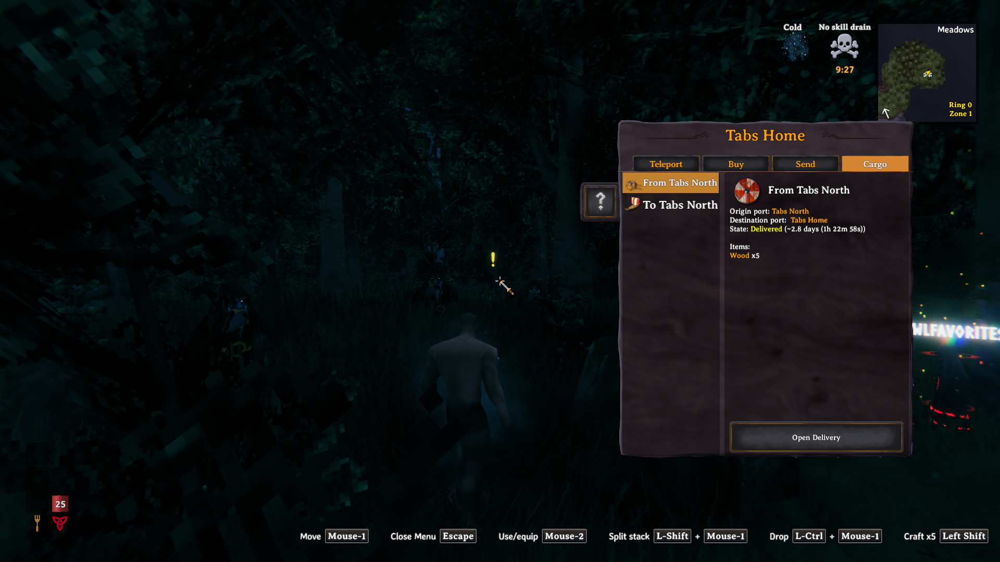
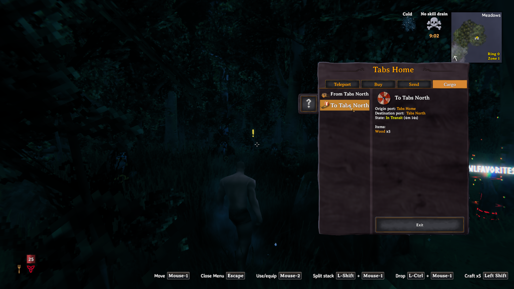
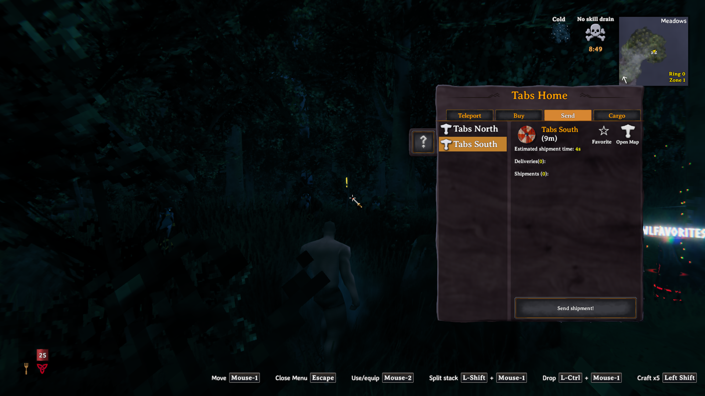
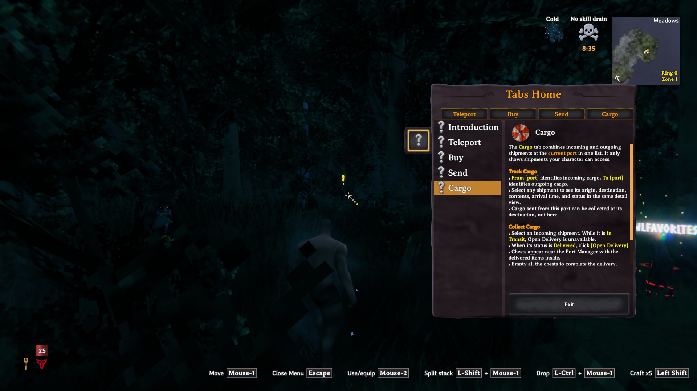

# Unified Cargo: Valnet proof

Captured on valnet-client-01 on 2026-09-29 using code commit d54986c, TestingWorld, and the maintained Praetoris Season 8 profile aligned to deployed release 8.0.29. The candidate MWL DLL and a temporary test helper were added for this run. These are original, unedited OBS screenshots.

The Cargo list contains both incoming and outgoing shipments. Selecting incoming cargo shows its origin, destination, delivered state, contents, and Open Delivery action.

An actual mouse click selected the outgoing row in the same list. Its detail view shows the opposite route, In Transit state, contents, and Exit action.

Send now lists destinations directly, without subtabs. The top-level order is Teleport, Buy, Send, Cargo. Favorite remains beside Open Map.

Help describes the combined Cargo list, From/To labels, and collection at the destination.

Additional checks: refreshing cargo retained either selected shipment; Exit closed the window; reopening selected Teleport; shipment refresh did not replace the open help page. Release build passed with 0 errors and 149 existing warnings. Candidate logs contained the known Linux shader-platform errors and existing mod warnings, with no port UI exception.

Scope: UI selection, routing, action state, and rendering with seeded shipments. This run did not execute a complete purchase/send/collect transaction or a dedicated-server multiplayer flow.
