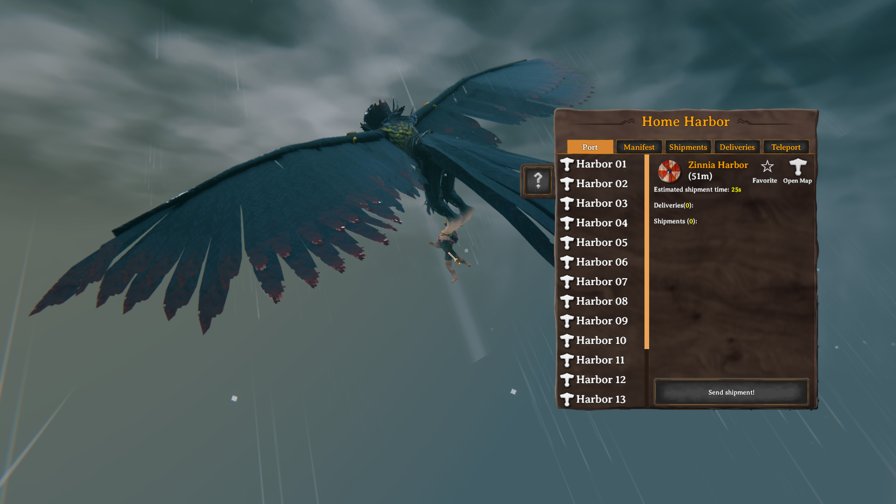
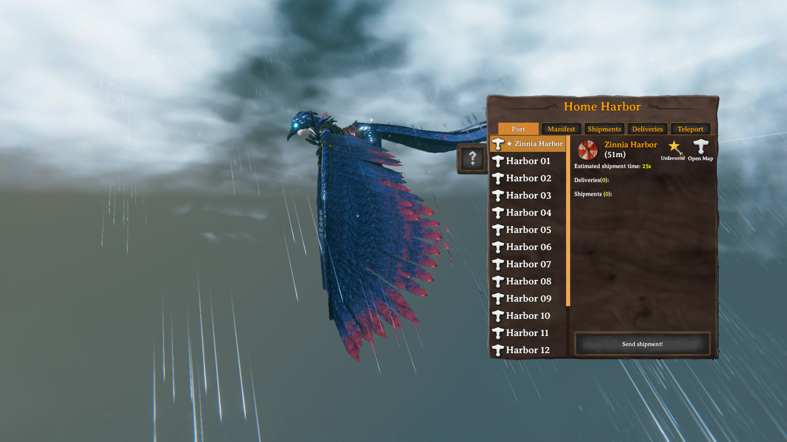
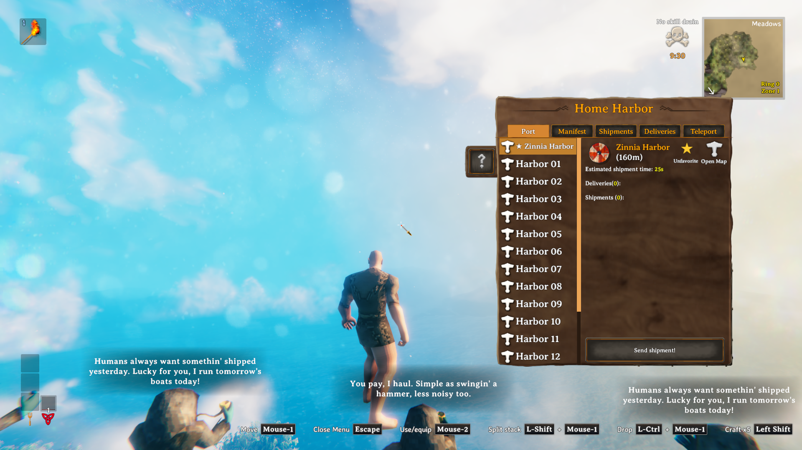
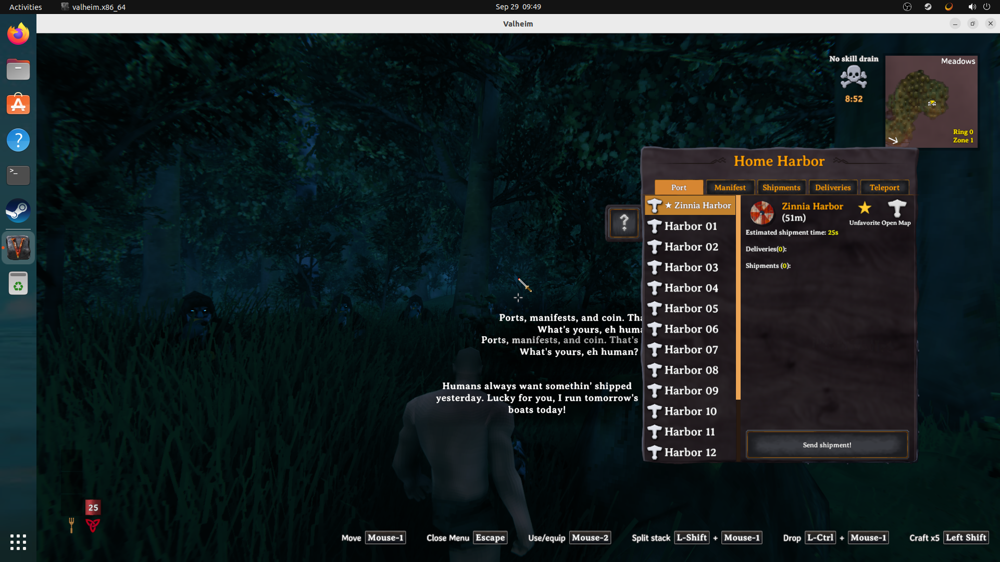

# Valnet image proof: port favorites

Captured on valnet-client-01 on 2026-09-29 in TestingWorld, using the maintained Praetoris Season 8 client profile aligned to deployed release 8.0.29 and the candidate MWL DLL. These are original OBS captures. Temporary test ports provided a long destination list.

Before clicking Favorite: Zinnia Harbor is selected but is below the visible alphabetical rows. The star beside Open Map is empty.

After an actual mouse click: Zinnia Harbor moves to the first row, stays selected, and the button changes to a filled star and Unfavorite. This initial capture occurred during the character's introductory flight.

After normal logout and character/world reload: Zinnia Harbor remains starred and first in the list.

Final Release build check at ground level: the favorite remains selected and first, beside the Open Map control. This is the final layout for code commit cbc75ed.

The images show UI state. Persistence was checked through the logout/reload sequence; a single image alone cannot establish that sequence. This was a local client test with the production client mod set, not a dedicated-server multiplayer test.
