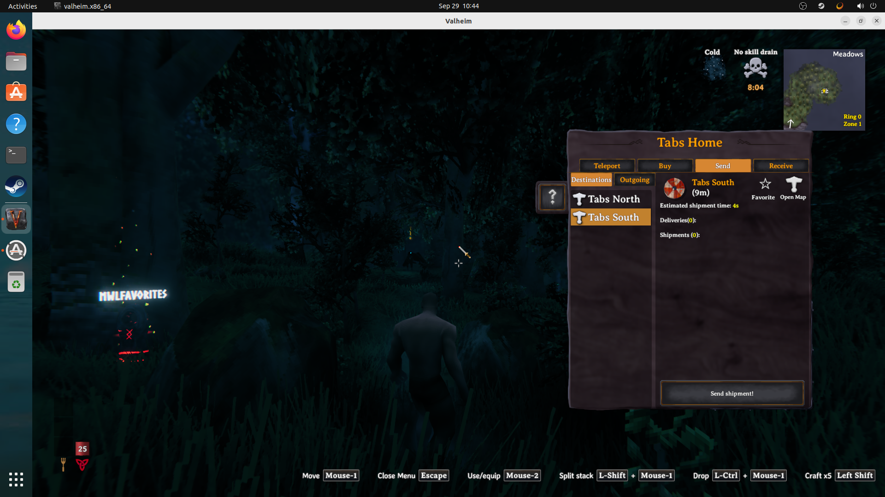
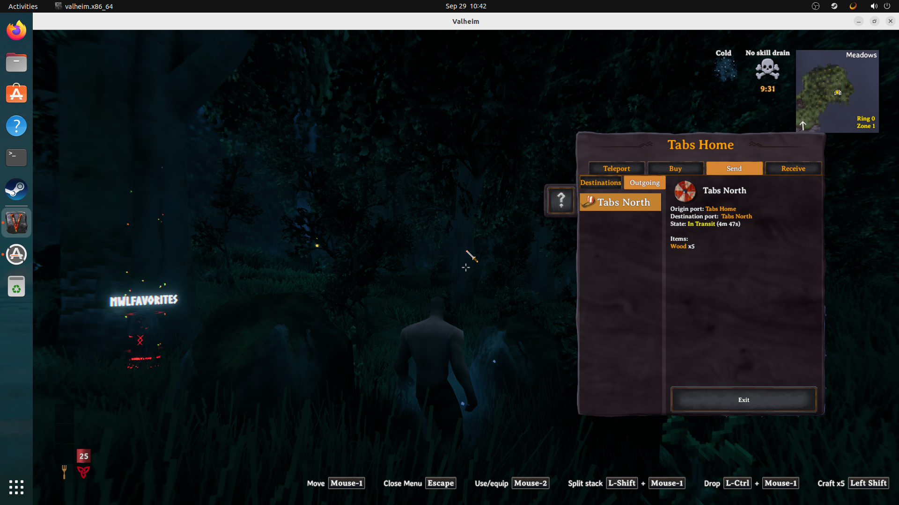
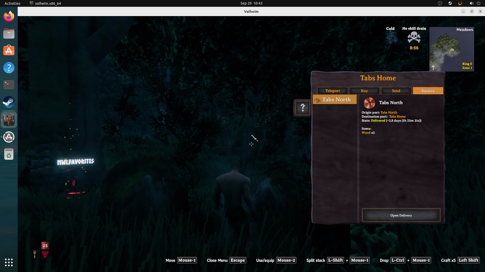
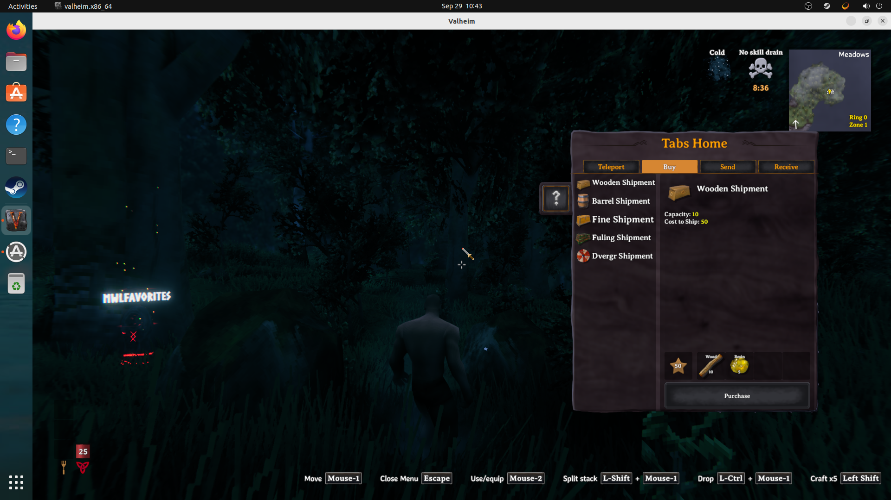
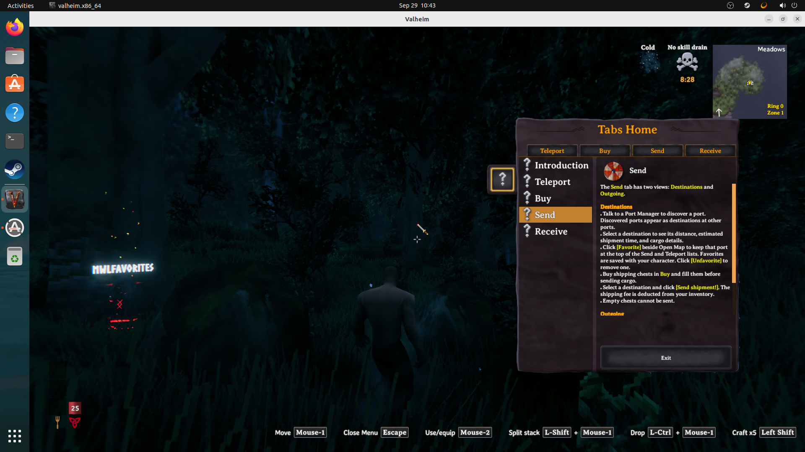

# Valnet image proof: port tabs

Captured on valnet-client-01 on 2026-09-29 in TestingWorld, using the maintained Praetoris Season 8 client profile aligned to deployed release 8.0.29 and candidate code e28b791. These are original OBS captures. Temporary ports and seeded shipments provided the UI states.

Send → Destinations: the four top-level tabs are Teleport, Buy, Send, Receive. A selected destination shows Favorite and Open Map.

Send → Outgoing: the selected shipment shows its route, transit status, and Wood x5. The action is Exit.

Receive: the incoming shipment shows Delivered and the Open Delivery action.

Buy: selecting Wooden Shipment shows its capacity, shipping cost, purchase requirements, and Purchase action.

Help: the topic list matches the new tabs. The Send page explains Destinations, favorites, sending cargo, and Outgoing; the remaining text is available by scrolling.

Scope: these images prove rendered UI states. The live run also checked switching views, selection retention after refresh, default-tab behavior, and Exit. It did not repeat a complete purchase/send/collect transaction or dedicated-server multiplayer flow.
